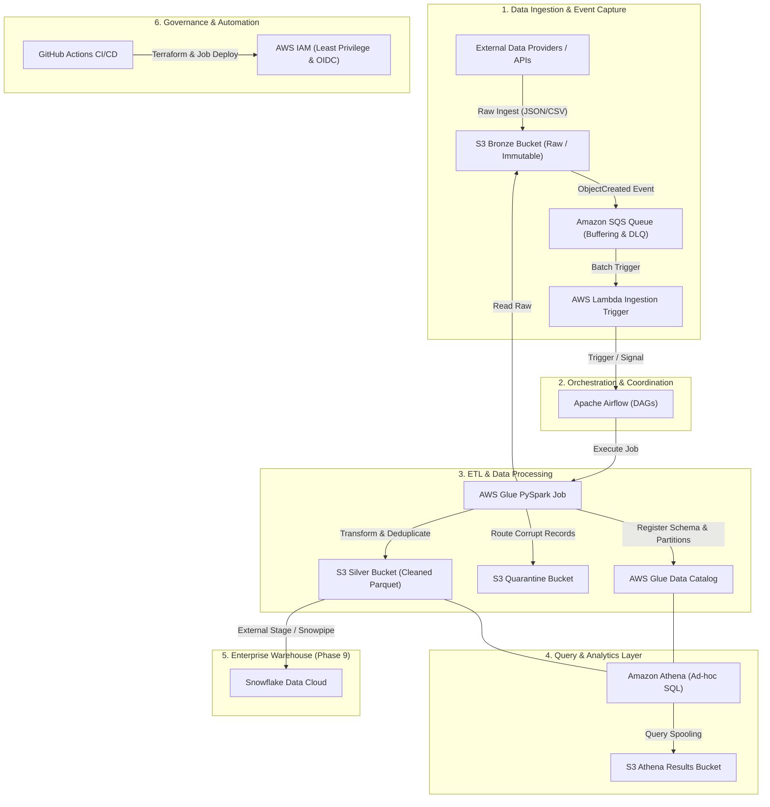

# Cloud Data Platform Architecture

## 1. Overview & Architectural Philosophy

This blueprint defines an enterprise-grade, GitOps-driven modern data platform built natively on AWS with future-ready integration for Snowflake. The platform adheres to the **Medallion (Bronze/Silver/Gold) architecture**, event-driven processing patterns, zero-trust IAM principles, and strict Infrastructure-as-Code (Terraform) governance.

### Core Tenets
- **GitOps First**: All infrastructure, schemas, ETL jobs, and orchestration definitions reside in version control. Deployments are declarative, auditable, and automated.
- **Decoupled Compute and Storage**: Persistent data lives in Amazon S3, allowing compute layers (AWS Glue, Amazon Athena, Apache Airflow, Snowflake) to scale independently.
- **Fail-Safe Ingestion & Quarantine**: Malformed or non-compliant records are segregated into a dedicated quarantine layer rather than silently dropped or halting pipelines.
- **Event-Driven & Scheduled Processing**: Real-time arrival notifications feed SQS/Lambda triggers, while complex batch workflows are coordinated by Apache Airflow.

---

## 2. High-Level Architecture Diagram

---

## 3. Storage Tier Definitions

| Layer | Bucket Role | Format | Retention / Lifecycle | Description |
| :--- | :--- | :--- | :--- | :--- |
| **Bronze** | Raw Ingestion | Original (JSON/CSV/Parquet) | 90 days Transition to Glacier | Immutable raw data landing zone partitioned by ingestion date (`year=YYYY/month=MM/day=DD`). |
| **Silver** | Curated & Validated | Snappy Parquet | Standard | Cleaned, deduplicated, schema-enforced datasets registered in the Glue Data Catalog. |
| **Quarantine** | Error Isolation | JSON with error metadata | 30 days Expiration | Malformed records rejected by validation logic for triage and debugging. |
| **Athena** | Query Spillover | CSV / Parquet | 7 days Auto-delete | Query execution spools and intermediate result sets generated by Athena workgroups. |

---

## 4. Key Platform Components

1. **Terraform**: Manages AWS resources across isolated environments (`dev`, `qa`, `prod`) using modular patterns and S3/DynamoDB remote state backends.
2. **Amazon SQS & AWS Lambda**: Decouples S3 ingestion notifications from downstream compute, absorbing traffic spikes with dead-letter queue (DLQ) support.
3. **AWS Glue (PySpark)**: Serverless distributed data processing engine executing Bronze-to-Silver transformations, type casting, schema validation, and partition writes.
4. **AWS Glue Data Catalog**: Centralized metadata repository storing table schemas, partitions, and column statistics.
5. **Amazon Athena**: Interactive SQL query engine for ad-hoc exploration, data quality validations, and business reporting directly against Silver Parquet files.
6. **Apache Airflow**: Workflow orchestrator managing dependency graphs, scheduling, sensor triggers, retries, and operational alerting.
7. **Snowflake (Future Scaffolding)**: Analytical data warehouse connecting to S3 Silver via secure IAM roles and external stages.
8. **GitHub Actions**: Automated CI/CD pipeline enforcing static code analysis (Ruff), unit testing (Pytest), Terraform validation, and OIDC-authenticated AWS deployments.
